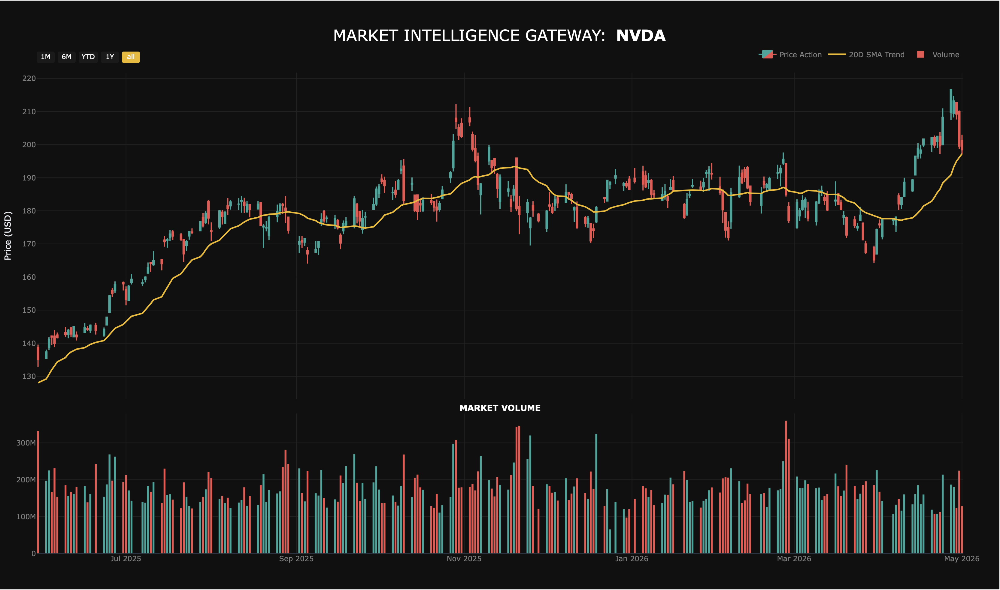
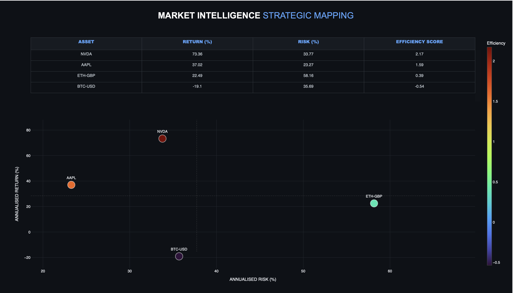

# MarketPulse-Analysis-Engine
Project Components
1. Asset Intelligence Detail Engine (market_pulse.py)

A tactical tool designed for high-fidelity visualisation of individual market assets.

* Core Function: Synchronises interactive Candlestick charts with Market Volume subplots.

* Quantitative Signal: Automated 20-Day Simple Moving Average (SMA) trend identification.

* Use Case: Identifying precise entry and exit points for high-conviction trades.

2. Strategic Portfolio Mapper (portfolio_comparator.py)

A macro-level decision tool for analysing risk-adjusted returns across diverse asset classes.

* Core Function: Dynamic user-input for real-time comparative analysis.

* Quantitative Model: Annualised Volatility vs. Cumulative Return quadrant mapping.

* Key Metric: Integrated "Efficiency Score" (a simplified Sharpe Ratio) to identify "Alpha" within a portfolio.

Technical Methodology
To ensure institutional-grade accuracy, the suite employs the following logic:

* Data Normalisation: Automated handling of MultiIndex dataframes and time-series alignment.

* Risk Modelling: Volatility is annualised using the square root of time (252 trading days) to ensure comparability across Equities, Forex, and Crypto.

* Defensive Programming: Implementation of validation gateways to intercept malformed API requests and handle delisted tickers gracefully.
